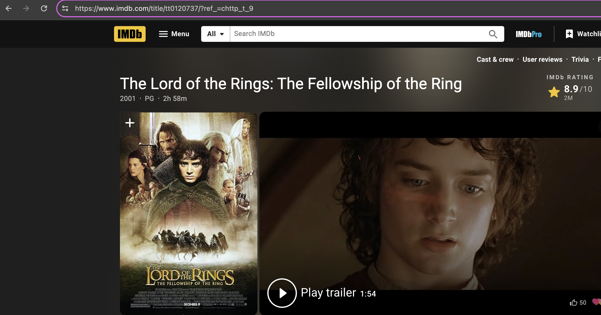

##  IMDB Political Review Classifier 

### Disclaimers
#### Disclaimer: Non-Political Affiliation
The content and context of this project do **not reflect any political affiliations** or ideologies of the creator. Any interpretations or assumptions linking the project's material to specific political views are unfounded and not endorsed.

#### Content Sensitivity Disclaimer
Please be advised that this project may contain material that could be considered offensive to some individuals. This includes content derived from user contributions on IMDb. Viewer discretion is advised. The content is presented for educational, informational, or research purposes only and does not intend to harm, offend, or disparage **any group** or **individual**.

## Overview 

The application is designed to **scrape**, **classify**, and analyze IMDb film reviews to determine the influence of political bias on film ratings. It uses advanced natural language processing (**NLP**) techniques to categorize reviews into **neutral**, **left-leaning**, or **right-leaning** based on their content. This classification helps in recalculating the film ratings to provide a more unbiased view, reflecting the film's content rather than political sentiment. 

The main goal of this tool is to provide film enthusiasts, critics, and researchers with a clearer, more objective perspective on film ratings by filtering out potential biases introduced by politically charged reviews. This could help users make better-informed decisions about which films to watch, based on ratings that truly reflect viewers' opinions about the film's content rather than its political implications.


[Overview Video](https://www.youtube.com/watch?v=BqZAfo1lhQ8&t=24s&ab_channel=MSstudioHD)

## Full Document
[Application PDF](gitData/Joy%20Albertini_TA_project.pdf)

## IMDB Link
For the Jupiter Notenbook and Application site to correct link to give is 



## Installation 
To create a new environment
```bash 
python -m venv .venv 
```
to activate the new environment
```bash
source .venv/bin/activate
```
while active install the dependencies
```bash
pip install -r requirements.txt
```

This project, which utilizes `selenium` for scraping data as demonstrated in `IMDB_Extended.py`, requires the **Chrome web browser** to be installed on your machine. Additionally, it makes use of the `ChromeWebDriver` extension for Chrome to facilitate data scraping.
The code is designed to automatically install `ChromeWebDriver` on your machine. If you prefer not to test the scraping capabilities of the application, you can simply use the already scraped data. By not adding a new link, `ChromeWebDriver` will not be installed.

### Train the model 
To create and train the model, simply run `political_bias_train.ipynb`` to initiate the training and model creation process.

### Run the application 
For this project, I have also developed a user interface that allows you to run the project outside of Jupyter Notebooks. To start, execute the following command:
```bash
python Interface.py
```
This will launch a webpage at [http://127.0.0.1:8080/](http://127.0.0.1:8080/).

Scraping and generating the report of an IMDB page can take a while, for IMDb pages with a lot of reviews.

### Support
If you encounter any issues running the application, please contact me at my USI email.

### Notebooks 
In this project there are several jupiter notebook 
- `political_bias_train.ipynb` : train the model and generated the data 
- `ploitical_review.ipynb` : is a notebook that you can put the link of a film and will analyze it, can give some problem in pycharm due to the html code, if it does unstrust then trust it an re run it, or open it with visual studio code it works great there
- `rating_analysis.ipynb` : create the distributions of ratings. 
- `political_review_display` : DONT run it, is for creating html pages, can make lag the editor if runned. 

## Technologies 
- **SpaCy:** Handles text analysis and classification of reviews by political orientation.
- **Python Dash:** Builds the interactive user interface for displaying results and settings.
- **Plotly:** Creates visual representations of data, such as rating distributions.
- **HTML/CSS:** Styles the web interface, enhancing visual appeal and usability.
- **Selenium:** Automates the scraping of IMDb reviews to gather necessary data.

## Analysis

In the `Data` folder, you will find several films already scraped, along with generated HTML pages for the political analysis.